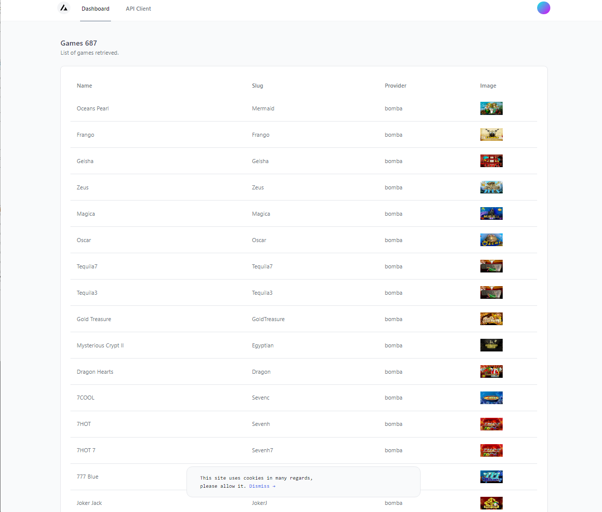
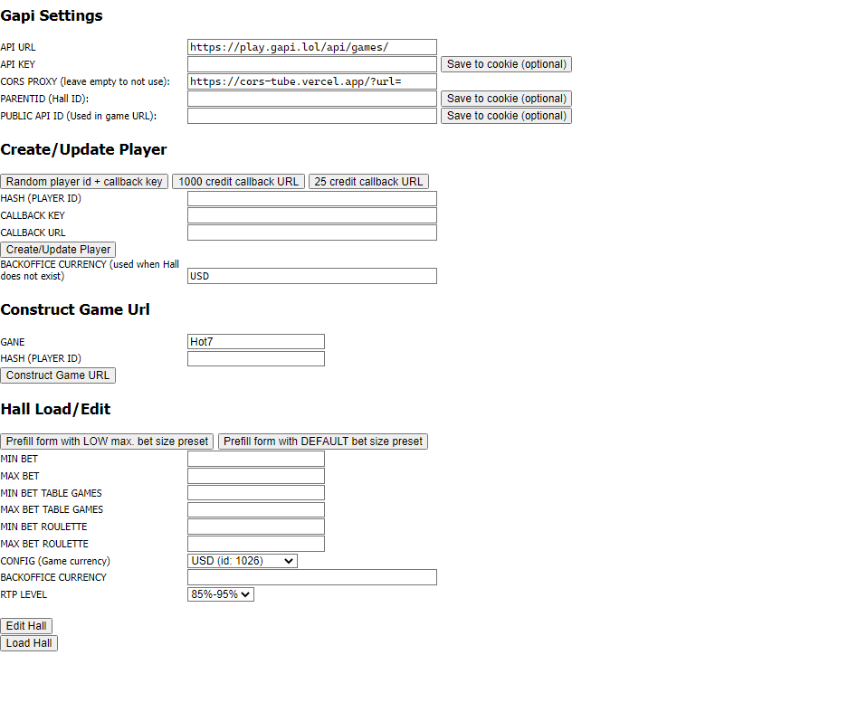

## Gapi Test Client
Client only for test gapi service, which seems to be great API service. I made this while integrating.

It includes a standalone html client, however all codes are non refactored/messy just because this really was to test stuff out. 

Idea was to transition the standalone client into this next.js system just don't have much more use for it currently cause of the simplicity of the API service that makes small room for errors (I hope).

# Install

### 1. Register free database on planetscale/cloudflare: [https://planetscale.com](https://planetscale.com).

### 2. Copy the example .env and set all values, including the database url

### 3. Run commands:
`npm run install`
`npx prisma db push`
`npm run seed`
`npm run dev`

# Features:
- Parse images, trying first from SS and as fallback the original (same sized) gapi image URL. Using CORS/serverside fetching so the filename stay uniform. To load image just go to `http://localhost:3000/api/gapiImg/<PROVIDER>/<MENU_TITLE>.png` - for example: `http://localhost:3000/api/gapiImg/amatic/Hot7.png`. To set different thumbnail sizing change the SS url in `pages/api/gapiImg/` file between `s1`, `s2`, `s3`, `s4`. 
***(This is quite intensive for the next.js system, I really just using it to save the thumbnails after loading them once to local disk then host in own cdn/casino page the thumbs locally.)***

- Seeds games to your database automatically, simply update it in `prisma/seed.js`

- Admin auth support, just set your admin passwords in `.env`. Currently has no use, the games list page is 'protected' by login only to test authentication, using planetscale starter package for this.

- Standalone API adminning client, not required to use at all in next.js. You can copy it and run locally or on your own pages (with local apikey saving etc.) - simply copy the `public/client.html` file. Has presets, I mainly used it for creating players and editing bet values in "Hall"

- Mock API  (see `pages/api/cb.ts`), with feature to set start balance based on the securekey given when you create the player in GAPI system (use the `standalone client` to create users if need be). If user does not exist it will create it automatically when getting callback from gapi api server, by configuring special tagged securekeys you can decide the user's balance.

- You can set start balances for non existing users in advance (test only), by specifying the securekey in your GAPI API ledger (inituser), for example currently it's set to `TEST_STARBAL-[insert amount here]`, so if you want non existing user when receiving first callback from GAPI to start with 25.00 $(credits) as balance you put: `TEST_STARBAL-25`. The maximum currently it's set on 25, so you can do `TEST_STARBAL-4` for start with 4(credits) and so forth.

- When specifying the "callbackurl" enter host of whereever you host this + "/api/cb.ts", like `https://localhost/api/cb`

- Games overview (was gonna build it out a bit more)

- CORS proxy support (was gonna build this out a bit more within this middleware sort of setup, but it's gonna cost too much time and working in other code anyway). You can view working test examples (not used for anything) in `middleware.ts` - this was mainly to parse images everywhere so can pick best images.

## Screenshots

